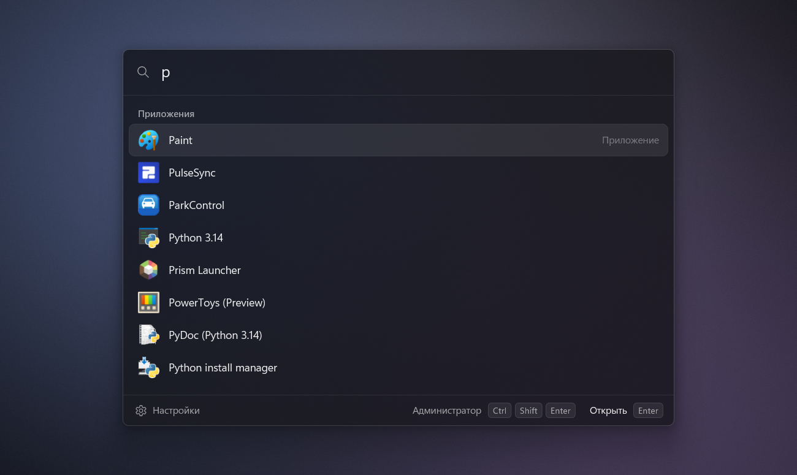

<p align="center">
  
</p>

<h1 align="center">MixLauncher</h1>

<p align="center">
  Нативный лаунчер для Windows 10/11 в духе Spotlight и Raycast, который заменяет меню «Пуск».<br>
  Чистый C без зависимостей: один <code>.exe</code> около 400 КБ, около 27 МБ памяти, окно за ~9 мс.
</p>

<p align="center">
  
  
  
</p>

<p align="center">
  <a href="#возможности">Возможности</a> ·
  <a href="#сборка">Сборка</a> ·
  <a href="#запуск">Запуск</a> ·
  <a href="#настройки">Настройки</a> ·
  <a href="#устройство">Устройство</a>
</p>

## Возможности

- **Приложения** — все, что есть в меню «Пуск» (Win32 и Store/UWP, через `shell:AppsFolder`).
  Порядок: насколько имя совпадает с запросом, плюс как часто и недавно вы запускали приложение,
  плюс что вы обычно выбирали по такому же запросу (набрали «ch» и открыли Chrome — в следующий
  раз Chrome будет первым).
- **Файлы** — ниже приложений, через Everything (IPC напрямую, без DLL из SDK). Результаты
  переранжируются: совпадение с именем, свежесть, штрафы за мусорные места (`AppData`,
  `node_modules`, `.git`, кэши, `WindowsApps`, служебные расширения), бонус за часто открываемые.
  Сначала показываются 40 лучших, а прокрутка сразу рассчитана на все найденные файлы (их число
  видно в заголовке секции): ещё не загруженные рисуются «скелетоном» и догружаются страницами по
  256 из Everything, только когда до них докручиваешь (страница — около 15–20 мс, в покое лишних
  запросов нет; диапазон прокрутки ограничен 100 000 файлов).
- **Неправильная раскладка**: `rfkr` найдёт «Калькулятор», `сщву` найдёт VS Code (и файлы по `code`).
- **Скрытые ключи**: на русской Windows `notepad`, `cmd`, `regedit`, `calc`, `settings` находят
  «Блокнот», «Командную строку» и т.д. (по имени exe и имени пакета).
- **Команды питания**: «Заблокировать», «Спящий режим», «Перезагрузка», «Завершение работы»,
  «Выйти из системы», «Корзина». Опасные команды требуют второго Enter.
- **Анимации**: окно проявляется целиком (стекло, рамка, тень) за 160 мс, содержимое «наплывает»
  с 97 %, строки появляются каскадом (по 12 мс); закрывается за 90 мс. Выделение, прокрутка и
  «пилюля» разделов в настройках движутся на критически задемпфированных пружинах (скорость не
  рвётся при быстром повторе клавиш), переключатели и наведение — плавные. Повторное нажатие
  посреди анимации разворачивает её без скачка. Отключаются параметром `animations = 0` или
  системной настройкой «Эффекты анимации»; все тайминги — в настройках, раздел «Анимация».
- **Контекстное меню** (ПКМ, клавиша меню) нарисовано самим лаунчером: монохромные значки,
  сочетания клавиш справа, плавное появление и «пилюля» наведения; управляется стрелками,
  `Enter` и `Esc`.
- **Как «Пуск» поверх полноэкранных приложений**: если панель задач скрыта полноэкранным окном
  (игра, видео, браузер в F11), при открытии лаунчера она появляется, а при закрытии снова
  прячется, и фокус возвращается в приложение.
- **Закрывается по клику вне окна** (клик при этом доходит до того, во что вы кликнули, например
  кнопка другого окна на панели задач срабатывает с первого раза).
- **Любая клавиша или сочетание для вызова** (по умолчанию `Win`): одиночное нажатие модификатора
  (`Win`, правый `Ctrl`…), сочетание (`Alt+Space`, `Win+D`…) или отдельная клавиша (`F13`).
  Выбранное сочетание перестаёт делать то, что делало раньше: `Win` не открывает «Пуск», `Win+D`
  не сворачивает окна.
- **Работает везде**, в том числе в играх и окнах, запущенных от администратора: лаунчер сам
  запускается с правами администратора. Всё, что открывается из него, запускается без прав
  администратора, от имени Проводника (кроме пункта «Запустить от имени администратора»).
- **Окно настроек** как в Raycast: кнопка «Настройки» слева внизу в лаунчере, `Ctrl+,` или пункт
  меню трея.
- Без ИИ, без сети, без телеметрии.

## Сборка

```bat
build.bat
```

Скрипт сам находит компилятор: MSVC (`cl`, в том числе через `vswhere`) или MinGW-w64
`gcc`/`clang` (MSYS2 `ucrt64`/`clang64` подхватываются автоматически). Результат —
`build\mixlauncher.exe` (требует прав администратора). `build.bat debug` собирает отладочную
версию, `build.bat dev` — `build\mixlauncher-dev.exe` с тем же кодом, но без запроса прав
администратора (для разработки и тестов). Перед сборкой скрипт просит уже запущенный экземпляр
того же exe завершиться, чтобы его можно было перезаписать.

## Запуск

Запустите `build\mixlauncher.exe` и подтвердите UAC: он работает в фоне, значок в трее.
Повторный запуск просто открывает окно. Автозапуск при входе в Windows включается в настройках
(«Общие» → «Запускать при входе в Windows»): создаётся задача планировщика «MixLauncher» с наивысшими
правами, поэтому при входе UAC не спрашивается. Обычный ключ `Run` в реестре для этого не годится:
Windows молча не запускает оттуда программы, которые требуют прав администратора.

| Клавиши | Действие |
|---|---|
| `Win` (одно нажатие; меняется в настройках) | открыть/закрыть вместо «Пуска» (`Win+E`, `Win+R` и т.п. работают как обычно) |
| `↑` `↓`, `Ctrl+N`/`Ctrl+P`, `PgUp`/`PgDn` | выбор |
| `Tab` / `Shift+Tab` | следующая/предыдущая секция |
| `Enter` | открыть |
| `Ctrl+Enter` | показать в папке |
| `Ctrl+Shift+Enter` | запустить от имени администратора |
| `Alt+Enter` | свойства |
| `Ctrl+C` | копировать путь (если в поле ничего не выделено) |
| `Esc` | очистить запрос, повторно — закрыть |
| ПКМ / клавиша меню | контекстное меню |
| `Ctrl+,` | настройки |

Пустой запрос работает как «Пуск»: часто используемые приложения, недавние файлы, все приложения.

## Настройки

Окно настроек в стиле Raycast (кнопка «Настройки» в лаунчере, `Ctrl+,`, пункт меню трея или
`mixlauncher.exe --settings`): разделы слева, группы параметров справа. Изменения применяются
сразу, без перезапуска:

- **Общие** — клавиша вызова, автозапуск, сколько секунд помнить последний запрос.
- **Внешний вид** — тема (системная, тёмная, светлая), фон (стекло, акрил Windows 11, сплошной),
  ширина окна, число строк.
- **Анимация** — вкл/выкл, общая скорость (%), длительности появления и закрытия окна, начальный
  масштаб, каскад строк (длительность и задержка), скорость выделения, прокрутки, меню и смены
  разделов настроек; кнопка «Открыть лаунчер» для проверки и сброс к значениям по умолчанию
  (ключи `anim_*` в `config.ini`).
- **Поиск** — сколько показывать приложений, скрывать деинсталляторы, обновить список
  приложений, с какого символа искать файлы, фильтр Everything.
- **Дополнительно** — очистить историю запусков, открыть `config.ini` и папку данных, есть ли права
  администратора.
- **О программе** — версия и запущен ли Everything.

Клавиша вызова задаётся в маленьком окне «Задайте сочетание…»: нажмите клавишу или сочетание — оно
появится в виде клавиш, `Enter` или «Сохранить» — применить, `Esc` — отмена. Пока это окно открыто
и активно, все нажатия (даже `Win`, `Win+D`, `Alt+Tab`) попадают только в него. Одиночный `Ctrl`,
`Alt` или `Shift` записывается с учётом стороны (например, правый `Ctrl`), `Win` — любой из двух.
Буквы, цифры, пробел, стрелки и т.п. без `Ctrl`, `Alt` или `Win` назначить нельзя: они нужны для
набора текста.

Управление с клавиатуры: `↑` `↓` / `Tab` — выбор, `←` `→` — изменить значение, `Enter`/`Space` —
переключить или нажать, `Ctrl+Tab` — следующий раздел, `Esc` — закрыть.

Все значения хранятся в `%LOCALAPPDATA%\MixLauncher\config.ini` (с комментариями; ручные правки
применяются после перезапуска лаунчера). Там же лежат `history.tsv` (частота запусков), `apps.cache` (кэш списка приложений для мгновенного
старта) и `log.txt`.

## Устройство

Методология как у File Pilot: unity build (`src/main.c` включает все модули, одна команда
компилятора), без фреймворков и без стандартных контролов, собственный immediate-mode UI поверх
собственного GPU-рендерера.

- `render.c` — Direct3D 11 + DirectComposition (swap chain с premultiplied alpha, поэтому под окном
  видно размытие DWM). Всё — инстансы одного квадрата: SDF-прямоугольники, глифы, иконки; один
  draw call на кадр. Кадры рисуются только при изменениях; во время анимации — синхронно с
  композитором (`DwmFlush`).
- `font.c` — растеризация глифов через DirectWrite (grayscale, natural symmetric, как в оболочке
  Windows 11) в атлас с 4 субпиксельными фазами, гамма и контраст как в DirectWrite, фолбэк шрифтов
  по символам. Интерфейсы DirectWrite/DirectComposition объявлены вручную в `com_min.h`
  (заголовки SDK только для C++).
- `apps.c` — индексация `shell:AppsFolder` в фоне, кэш на диске, слежение за папками «Пуска».
- `match.c` — нормализация (регистр, ё→е), нечёткий поиск с ярусами, конвертация раскладки.
- `history.c` — frecency с затуханием (период полураспада 14 дней) и память запросов.
- `everything.c` — IPC с Everything в отдельном потоке, «побеждает последний запрос».
- `icons.c` — иконки шелла в двух фоновых потоках, атлас на GPU с LRU.
- `hotkey.c` — low-level хук клавиатуры в отдельном потоке высокого приоритета (клавиша вызова
  через `RegisterHotKey` не регистрируется: так нельзя ни отнять у системы `Win+D`, ни поймать
  одиночный модификатор). Нажатие клавиши из сочетания проглатывается; если при этом зажаты `Win`
  или `Alt`, вставляется неназначенная vkE8, чтобы их отпускание не открыло «Пуск» или меню окна.
  Одиночное нажатие `Win` (или другого модификатора) подменяется последовательностью Win, vkE8,
  Win-up, поэтому «Пуск» не открывается.
  Надёжность рядом с другими программами на хуках (AltSnap, PowerToys, AutoHotkey):
  свои синтетические нажатия помечаются в `dwExtraInfo`, а нажатия, переотправленные другими
  программами, обрабатываются как настоящие; процесс отказывается от троттлинга EcoQoS; хук
  переустанавливается раз в минуту, а сторож на Raw Input видит каждое физическое нажатие Win и
  сразу переустанавливает хук, если Windows его тихо сняла (в логе: `keyboard hook re-installed`);
  пока Win зажата, клики и колесо мыши считаются комбинацией (Win+перетаскивание в AltSnap).
  Окно забирает фокус ещё до первого кадра, поэтому буквы, набранные сразу после Win, не теряются.
  Важная тонкость: пока процесс с регистрацией Raw Input находится на переднем плане, Windows не
  вызывает его low-level хук, поэтому сторож работает только пока на переднем плане нет ни одного
  окна MixLauncher (лаунчера, настроек, меню): иначе `Win` проходило мимо хука и открывало «Пуск».
  Переключение отслеживается через `EVENT_SYSTEM_FOREGROUND` (окно берётся из самого события:
  `GetForegroundWindow()` в этот момент может ещё вернуть предыдущее). Лаунчер переключается только после того,
  как хук увидел собственную «маскирующую» последовательность, и никогда не отдаёт фокус окнам
  оболочки (панели задач, рабочему столу).
- Панель задач над полноэкранным приложением: оболочка сама опускает её под такое окно и не даёт
  поднять извне, но показывает снова, когда активируется обычное окно приложения (как при Alt+Tab
  из игры). Поэтому в этом случае лаунчер открывается как обычное окно (не topmost, не tool) и
  сразу убирает свою кнопку с панели через `ITaskbarList::DeleteTab`.
- `elevation.c` — работа с правами администратора. Low-level хук процесса с правами
  администратора получает нажатия и тогда, когда активна игра или окно администратора, поэтому
  отдельный помощник не нужен. Запускать программы от администратора при этом нельзя, поэтому
  `ShellExecute` выполняется в процессе Проводника (`IShellWindows` → `IShellDispatch2`), и
  программы получают обычный уровень прав. Сообщения от Проводника (значок в трее) и ответы
  Everything пропускаются через фильтр UIPI (`ChangeWindowMessageFilterEx`).
- `settings.c` — окно настроек: тот же рендерер (второй swap chain), те же примитивы, фон Mica,
  без системного заголовка (свои кнопки «Свернуть» и «Закрыть», перетаскивание за полосу заголовка).
- `launch.c` — запуск в отдельном STA-потоке, чтобы медленный запуск никогда не блокировал
  интерфейс.

Показ окна занимает около 9 мс, пересчёт результатов на нажатие клавиши — около 0.03 мс,
кадр — меньше 1 мс CPU.

## Ограничения

- Задача автозапуска запускает `mixlauncher.exe` с правами администратора из того места, где он
  лежит. Если exe лежит в папке, куда можно писать без прав администратора (Рабочий стол,
  Загрузки), любая программа от вашего имени может его подменить. Надёжнее положить его, например,
  в `C:\Program Files\MixLauncher` и включить автозапуск уже оттуда.
- Если Проводник не запущен, программы из лаунчера запускаются напрямую и наследуют права
  администратора.
- Клик по кнопке «Пуск» на панели задач по-прежнему открывает стандартное меню.
- Если клавиша вызова — одиночный `Win`, то буква, нажатая до отпускания `Win`, даёт сочетание (например, `Win+C`), а не открытие
  лаунчера — так же ведёт себя и стандартный «Пуск».

## Отладочные ключи

`--pin` (показать на мониторе без курсора, без фокуса, без хука и значка в трее; можно запускать рядом
с работающим экземпляром),
`--other-monitor` (обычная работа, но на мониторе без курсора; при выходе пишет в лог трассировку
решений хука клавиши вызова),
`--query <текст>`, `--backdrop blur|acrylic|solid`, `--theme dark|light`, `--settings`,
`--dump-apps <файл>`, `--test-everything <запрос> <файл>`, `--test-unelevated <файл>` (запускает
`whoami /groups` через Проводник и пишет вывод в файл — проверка, что программы стартуют без прав
администратора), `--exit`.
